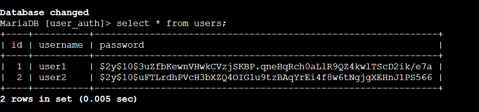
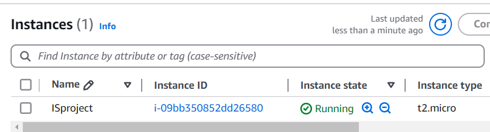
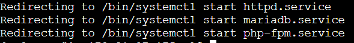
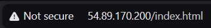

# **Secure SQL Login System**

This project demonstrates the creation of a secure login system designed to prevent SQL injection attacks, a common web application vulnerability.

## **Introduction**
The primary objective of this project is to safeguard sensitive data and protect the login process against unauthorized access. It achieves this by addressing SQL injection vulnerabilities through secure coding practices.

## **Features**
1. **Password Hashing**  
   User passwords are securely hashed using PHP's `password_hash()` function. Verification is performed using `password_verify()`.

2. **Input Sanitization and Validation**  
   User inputs are sanitized using `htmlspecialchars()` and `trim()` to prevent harmful scripts and SQL fragments.

3. **Prepared Statements and Parameterized Queries**  
   SQL queries are implemented with prepared statements, which isolate user inputs from query logic.

4. **Resilience Against SQL Injection**  
   The system is tested against various SQL injection techniques to ensure data safety.

## **Technologies Used**
- **PHP**
- **MySQL**
- **HTML/CSS** (for the login form)
- **AWS**

## **Getting Started**
### **Prerequisites**
- A web server (e.g., Apache, Nginx)
- PHP 7.0 or higher
- MySQL database

---

## **Screenshots**

### **Login Page**

### **Post-Login Page (Student Data)**

### **MySQL Database Setup**

### **AWS Instance**

### **Services used**

### **Using IP to access form**

---

## **AWS Deployment**
This project is deployed on AWS to demonstrate secure and scalable web hosting.

### **Steps to Deploy on AWS:**
1. **Launch** an EC2 instance using a Linux AMI.  
2. **Install** a web server (e.g., Apache or Nginx) and PHP.  
3. **Set up** MySQL database on the EC2 instance.  
4. **Configure** security groups to allow HTTP and SSH access.  
5. **Deploy** the project files to the EC2 instance.  
6. **Test** the system for accessibility and SQL injection prevention.

---

## **Conclusion**
By implementing secure coding practices such as hashing, sanitization, validation, and prepared statements, this project demonstrates the effectiveness of mitigating SQL injection attacks. Deployment on AWS ensures scalability and reliability for real-world use.

---

**Note:** Replace `path/to/your-image.png` with the actual paths or URLs of your images.
